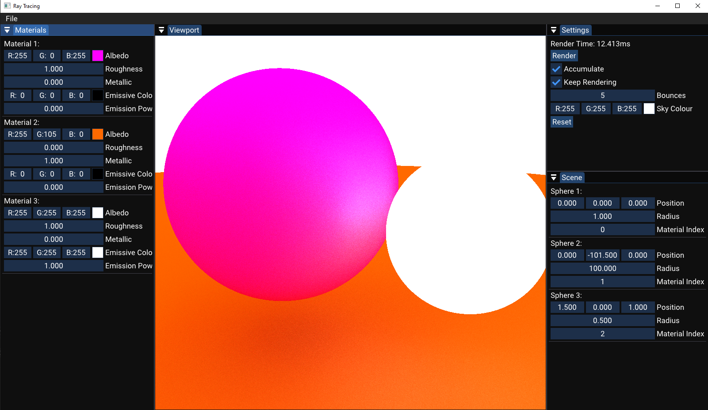

Building:
Run "Setup.bat" in the scripts folder and then run the program inside VS2022. 

TO DO:
Light calculations for materials
Option to add primitives and materials on runtime
More primitive shapes
Have the option to ray trace on hardware